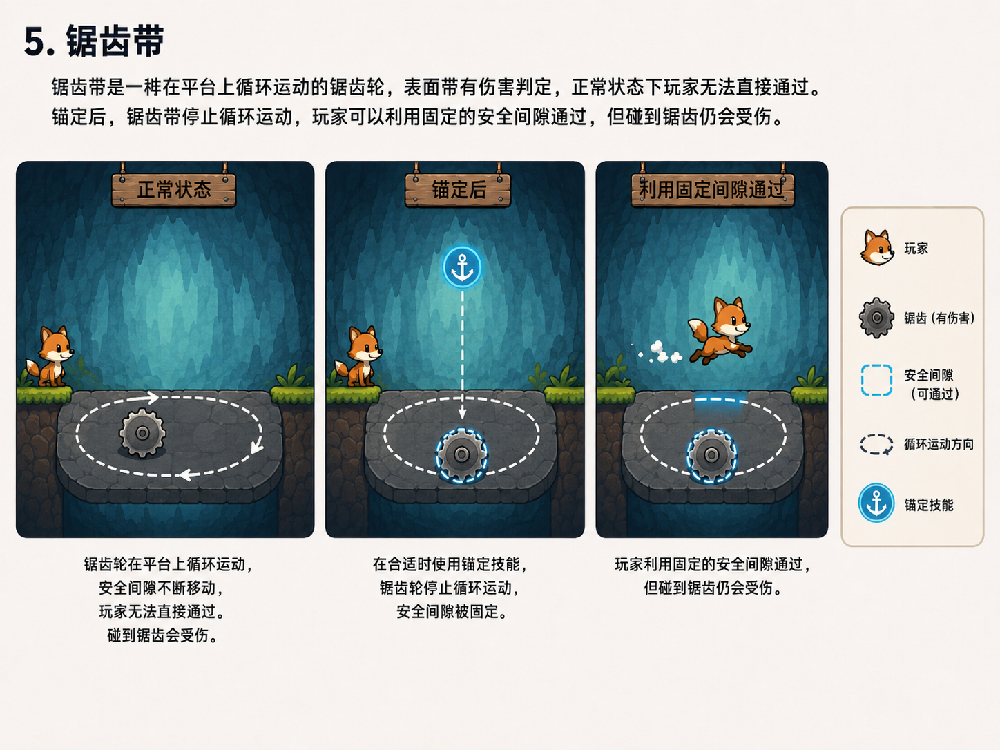
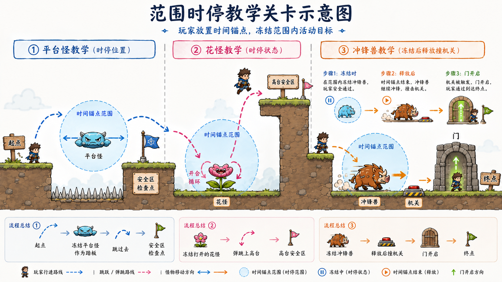

# CIGA GJ 策划案

# 一、一句话玩法

玩家可在指定位置放置“时间锚点”，使圆形范围内的怪物暂时停止行动（玩家不受影响）。玩家利用被冻结的怪物作为平台、弹跳机关或解谜工具，到达关卡终点。

# 二、游戏背景

**一句话背景：**

时间仍在流逝，唯有你手中的时间锚点能将局部时空强行“切断”——在被冻结的刹那间，踏着敌人的尸骸前行。

**核心设定：**

你是一名“时律行者”，手持上古遗物「时间锚点」。在这个危机四伏的遗迹中，万物依循时间法则运转——怪物冲锋、尖刺伸缩、齿轮滚动。而你，是唯一能违背法则的存在。按下E键，以罗盘为中心张开一道**“绝对静止域”**，域内万物瞬间凝固成冰冷的雕塑，成为你借力的跳板。当封印解除，一切将从冻结前的那一刻，继续奔向毁灭。

# 三、玩家操作

|操作|按键|规则|
|---|---|---|
|左右移动|A/D|控制角色水平移动|
|跳跃|Space|玩家在地面时可跳跃|
|时停道具|Q|冻结以鼠标为中心圆圈范围内物体|
|重新开始|R|重置当前关卡|
|暂停|Esc|打开暂停界面|
|打开宝箱|E|靠近宝箱弹出提示按F即可打开|

- 玩家不能二段跳

- 玩家不能踩怪物，碰怪物掉血，碰到机关掉血，玩家初始三滴血

- 玩家掉坑或死亡后从关卡初始位置复活

# 四、范围时停规则

- 怪物只要在圆圈范围内，就算被冻结

- 怪物被冻结后仍有碰撞

- 冲锋怪冻结后不会继续造成伤害

- 玩家站在被冻结怪物上，解冻后会掉1滴血

- 玩家死亡后，时停和怪物状态全部重置

- 允许同时冻结多个怪物

- 时停结束前有闪烁提示

# 五、交互规则

## 移动平台

## 形态类怪物

- 弹跳功能只有被冻结后才生效

## 冲锋类怪物

## 宝箱规则

## 动态开关（只有玩家踩）规则

## 投掷物锚定规则

## 危险机关规则

- 锯齿带

示意图：

- 尖刺柱

示意图，锚定范围比图中小：

# 七、关卡流程

1. **基础**：冻结移动怪当踏板。

2. **进阶**：冻结花怪全开状态当高台（引入状态判断）。

3. **拓展**：冻结冲锋兽，释放后利用其惯性触碰机关开门。

# 八、美术需求

### 美术风格确认卡

1. **整体基调**

- **关键词**：永恒黄昏、寂静废墟、微光魔法

- **情绪**：孤独、神秘、唯美、略带忧伤

2. **色彩方案**

- **主色调**：**深紫罗兰 \+ 灰蓝 \+ 墨绿**（代表停滞的世界、腐朽的历史）

- **高亮色**：**暖橙/落日黄**（代表远方的希望、光源）、**荧光青/冰蓝**（代表时停力量、水晶）

- **主角色**：**炭黑/深灰**（剪影感）\+ **金属金/铜**（罗盘发光处）

3. **视觉参考（基于你发的图）**

- **环境**：巨大的、断壁残垣的古老建筑悬浮在虚空或深水上；枯死的巨树缠绕着发光的藤蔓；地面有破碎的齿轮和石板。

- **时停表现**：一个巨大的、**半透明的青色光球**笼罩区域，内部的物体表面结满冰霜，周围有静止的尘埃粒子。

- **光影**：强对比度的**体积光**（丁达尔效应），主角周围有一圈温暖的光晕，照亮脚下的路。

4. **角色形象**

- 一个小小的、黑色剪影般的身影（类似之前效果图中小人）。

- 手持一个散发着金色光芒的罗盘或沙漏。

- 动作轻盈，跳跃时有轻微的拉伸感。

# 九、参数表

